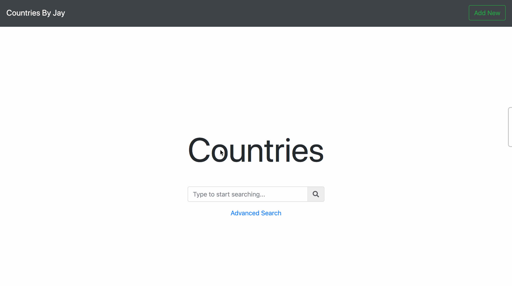

# countries

## Dependencies
 * PHP 7.3.9 -- WARNING 7.3.0 will prevent db compatibility 
 * MySQL tested with verison 5.6.27
 * Composer ^1.8.0
 * NPM - ^6.4.1

## Installation Instructions 
 1. Pull Repo 
 2. `composer install`
 3. `npm install`
 4. `npm run prod`
 5. `php artisan db:create`
 6. `php artisan migrate`
 7. `php artisan serve`
 8. In a browser go to http://127.0.0.1:8000

## Usage Instructions 

### Creating A Country

1. In the top left of the window click the 'Add New' button
2. Enter the country details in the modal 
3. Click Create at the bottom of the modal

### Searching Countries 
#### Name Search
1. You can perform a name search in the box at the center of the sreen 
2. Click the resulting items to view the details of the country
3. You can edit any of the information about the country in the modal
4. Click edit to confirm the changes
#### Advanced Search
1. Click The advanced search link
2. Fill out any of the fields you wish to search
3. Click Search
4. Results will appear below the form 
5. Click on a result to view it's details and edit them
